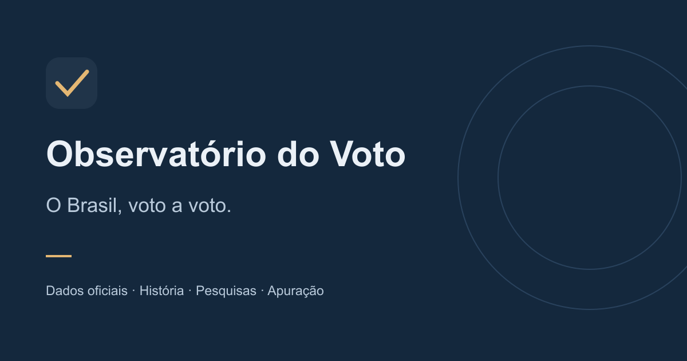

# Observatório do Voto

Acompanhe as eleições presidenciais brasileiras em uma interface com mapas, gráficos, pesquisas e histórico. Compare resultados por estado e região, consulte as fontes e personalize sua experiência no celular ou no computador.

[**Abrir o Observatório do Voto**](https://observatorio-voto.vercel.app/)

## Explore o app

- **Panorama:** visão geral da eleição e dos indicadores disponíveis.
- **Histórico:** compare eleições anteriores, de 1989 a 2022, com filtros de ano, turno, estado e região.
- **Seu município:** busque uma cidade e explore os votos presidenciais do primeiro turno de 2026 por escola, local de votação, zona ou seção. Os dados são coletivos e não revelam o voto de uma pessoa.
- **Pesquisas:** consulte intenções de voto, datas, metodologia e fontes das pesquisas disponíveis.
- **Apuração:** veja a contagem regressiva até 25/10 às 17h de Brasília e ative os alertas. Quando o TSE divulgar resultados, acompanhe os parciais com gráficos e atualização automática.

- **Cobertura:** explore conteúdos públicos relacionados à eleição.
- **Meu acompanhamento:** escolha estados no mapa ou pelo nome, compare seus resultados e use os atalhos para apuração e histórico. Escreva no caderno com salvamento automático; título, assunto e estado são opcionais.
- **Perfil e alertas:** veja um resumo do seu espaço pessoal, escolha seu candidato preferido e ajuste notificações e tema.

Na apuração, **Ver prévia com o 1º turno** apresenta a tela ampliada com resultados finais reais, claramente identificados. A noite da apuração ao vivo fica disponível após o início da divulgação do segundo turno. Mapas podem ser explorados pelo teclado ou pela tabela de estados; os gráficos de progressão também oferecem os valores em tabela.

O menu pode ser aberto quando você precisar. Seções extensas têm controles para expandir e recolher informações. O tema acompanha o sistema do seu dispositivo por padrão; você pode escolher Claro ou Escuro no menu **Tema** da barra superior, e as transições respeitam a preferência de movimento reduzido do dispositivo.

Você pode abrir os detalhes de cada pesquisa para conferir entrevistas, margem de erro e metodologia. Em **Meu perfil → Preferências**, ative a opção de mostrar esses detalhes automaticamente, se quiser mais contexto nas análises.

## Como usar

No primeiro acesso, as boas-vindas permitem escolher seu nome, quem deseja acompanhar e quanto contexto quer ver nas pesquisas. Você pode continuar sem personalizar. Antes de entrar, leia e aceite os [Termos de Uso](https://observatorio-voto.vercel.app/termos); as notificações são opcionais e têm uma ativação separada. Você pode rever a personalização no Meu perfil.

Abra o endereço publicado do app no navegador. Você não precisa de uma conta para consultar os dados. Use os filtros para mudar a eleição ou a região e abra as fontes para entender de onde vem cada informação.

Para receber alertas, use o botão das boas-vindas ou visite Alertas e permita o envio no navegador. Você pode escolher avisos de pesquisas, notícias, mudanças na apuração e confirmação do resultado. Um botão de teste ajuda a conferir o recebimento neste aparelho. Com o app em uso, a apuração é consultada a cada 30 segundos. Sem visitantes, um monitor consulta as fontes em intervalos previstos de 5 minutos, sujeitos a atrasos. A entrega depende do dispositivo, das permissões e da disponibilidade do serviço. No iPhone compatível, adicione o app à tela inicial antes de ativar as notificações.

Em Alertas, escolha receber atualizações comuns assim que houver novidades, no máximo uma vez por hora ou no máximo uma vez por dia. Avisos comuns são agrupados; resultado, vantagem irreversível e mudança de liderança continuam imediatos quando selecionados, sujeitos à consulta e entrega do serviço.

Use **Instalar app** na barra superior quando o navegador disponibilizar a instalação. Nos demais casos, **Como instalar** abre as instruções do seu aparelho em **Meu app**. Ao abrir pelo ícone, o app oferece atalhos fixos para Panorama, Apuração e Caderno; alguns sistemas também permitem atalhos ao pressionar o ícone.

Em **Meu app**, guarde um resultado nacional finalizado para ler sem conexão. A área offline também mostra as anotações já salvas neste ambiente, sem atualização de pesquisas ou apuração ao vivo. Para editar o caderno, volte ao app conectado. Na tela especial da apuração, aparelhos compatíveis podem manter a tela acesa mediante sua escolha. Esses recursos continuam gratuitos e variam conforme o navegador e o sistema.

## Seus dados e preferências

Seu candidato preferido, suas notas e outras preferências ficam neste navegador. Usar outro aparelho, limpar os dados do navegador ou navegar em modo privado pode remover essas configurações. Elas não formam um perfil público e não são sincronizadas entre aparelhos.

Anotações do caderno anterior são preservadas como uma entrada. É possível criar várias anotações, excluir e desfazer a última exclusão enquanto a tela estiver aberta. Os estados seguidos servem à comparação pessoal e aos atalhos; os alertas continuam nacionais. Veja o [Aviso de Privacidade](https://observatorio-voto.vercel.app/privacidade) para conhecer os dados usados nas notificações e na hospedagem.

Cartões de notícias e publicações mostram a imagem disponibilizada pelo veículo quando ela pode ser carregada. Os alertas também podem incluir essa foto e a manchete; a aparência depende do navegador e do aparelho. Sem imagem acessível, o texto continua disponível. As matérias completas permanecem nos sites de origem.

Os dados públicos são compartilhados entre os visitantes. O app não oferece edição de resultados oficiais, contas de editor ou salas de colaboração.

O Panorama destaca até três publicações novas identificadas desde a última visita neste navegador. Nas pesquisas e nos resultados, **Anotar sobre este resultado/pesquisa** guarda o contexto e a fonte no caderno. O indicador no topo confirma o salvamento no aparelho.

## Entenda os números

Resultados eleitorais usam o TSE como referência; o mapa usa dados do IBGE. Cada pesquisa deve ser lida com sua data, amostra, metodologia e fonte. Nem todos os institutos têm integração automática, e os dados históricos são retratos das eleições indicadas.

Nas pesquisas, alterne entre **Entre quem escolheu um candidato** e **Incluindo brancos, nulos e indecisos**. O levantamento é o mesmo; muda a base dos percentuais. Bases que o instituto não publicou são identificadas, sem números estimados.

A simulação redistribui apenas os votos dos demais candidatos do primeiro turno. Os votos dos finalistas ficam fixos; o cenário é uma hipótese pessoal, sem valor de pesquisa ou previsão.

Intenção de voto não é resultado oficial nem garantia de vitória. Durante a apuração, confira o percentual de urnas processadas e a identificação de cada resultado. Antes de a fonte disponibilizar dados, o app informa espera ou indisponibilidade.

Não há acesso ao engajamento individual de eleitores nas redes sociais. A cobertura disponível usa informações públicas, com atribuição às fontes.

## Disponibilidade dos alertas

Notificações podem atrasar ou não chegar; consulte a tela de apuração para conferir os dados disponíveis. A coleta em segundo plano depende do monitor e da disponibilidade das fontes.

## Sugestões e problemas

Use a aba **Issues** deste repositório para relatar problemas ou sugerir melhorias. Descreva a tela, o comportamento esperado e seu navegador. Não publique preferências políticas pessoais, tokens ou outros dados privados no relato.

Para executar ou contribuir com o código, consulte o [guia de desenvolvimento](docs/development.md). A hospedagem está documentada no [guia de publicação](docs/deployment.md); as atribuições, em [NOTICE.md](NOTICE.md).
