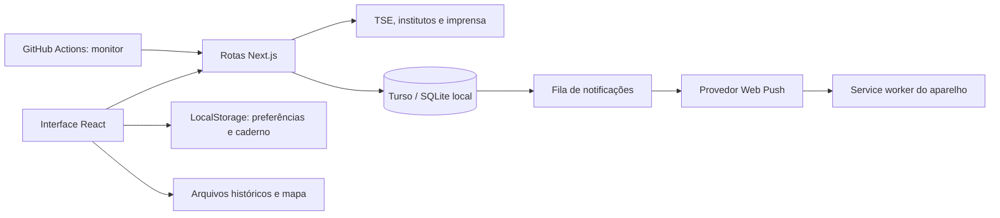

# Arquitetura

O Observatório é uma aplicação Next.js App Router com React e TypeScript. A interface mantém preferências no navegador; funções Node.js consultam fontes públicas e persistem cache e inscrições push em libSQL/Turso.

## Organização

| Diretório / módulo                                      | Responsabilidade                                                        |
| ------------------------------------------------------- | ----------------------------------------------------------------------- |
| `app/dashboard.tsx`                                     | Navegação, filtros e coordenação das telas                              |
| `app/components/`                                       | Componentes de apresentação extraídos do painel                         |
| `app/insights.tsx`, `app/user-space.tsx`                | Pesquisas, cobertura, acompanhamento, perfil e alertas                  |
| `app/api/`                                              | Fronteiras HTTP: entrada, origem, status e respostas                    |
| `lib/elections.ts`                                      | Normalização de dados oficiais e limite matemático de vitória           |
| `lib/polls.ts`, `lib/media.ts`, `lib/article-image.ts`  | Adaptadores de fontes, cache e prévias permitidas                       |
| `lib/database.ts`                                       | Interface SQL, configuração do libSQL e criação idempotente das tabelas |
| `lib/live.ts`, `lib/alerts.ts`, `lib/content-alerts.ts` | Consulta oficial e identificação de eventos                             |
| `lib/push.ts`                                           | VAPID, fila persistente, tentativas e controle de entregas              |
| `lib/notebook.ts`, `lib/poll-view.ts`                   | Validação do caderno e regras de cenários e bases das pesquisas         |
| `public/`                                               | Service worker, ícones, fontes, retratos e conjuntos de dados           |
| `tests/`, `scripts/`                                    | Testes de comportamento, validação de dados e smoke test                |

## Atualização dos dados

Os endpoints e seus estados estão descritos em [api.md](api.md).

O histórico e os retratos eleitorais incluídos em `public/data` são arquivos versionados, não uma coleta contínua. Pesquisas combinam retratos conferidos e descoberta de publicações; nem todo instituto permite extrair números automaticamente. Cada cartão preserva a data da fonte, separada da data da consulta.

Na apuração, o servidor valida o arquivo do TSE e usa cache compartilhado com uma concessão SQL temporária para reduzir consultas concorrentes. As chamadas HTTP são periódicas. Na Vercel, a tela ao vivo também pode abrir WebSocket pelo SDK experimental, com renovação da conexão e fallback HTTP. `next dev` não oferece esse upgrade.

O workflow de monitoramento consulta as APIs públicas para que a coleta não dependa de visitantes. A agenda e os provedores externos podem atrasar; não existe garantia de atualização ou entrega instantânea.

## Persistência e privacidade

As tabelas `cache`, `subscriptions`, `subscription_keys`, `push_events` e `push_deliveries` armazenam dados públicos, configuração VAPID e o necessário para entrega de alertas. A fila registra evento/aparelho para evitar duplicação e retomar falhas transitórias.

Nome local, candidato preferido, estados seguidos, anotações, tema e aceite dos termos ficam no navegador. Eles não são contas autenticadas nem sincronizados entre aparelhos. O aceite local não é uma prova centralizada vinculada a uma identidade.

As rotas de escrita verificam origem e validam inscrições. Prévias de artigos usam domínios permitidos, limites de resposta e verificação de redirecionamentos. Segredos não devem usar o prefixo `NEXT_PUBLIC_`.

## Limites atuais e evolução

O painel e o explorador ainda concentram várias telas; novas alterações devem continuar extraindo componentes e contratos tipados por domínio. Alguns adaptadores legados ainda usam tipos amplos para respostas externas. A normalização eleitoral e os componentes extraídos têm lint mais rigoroso; isso não substitui a revisão das demais fronteiras.

Não há login, permissão de editor, edição de resultados oficiais ou colaboração em notas. O projeto também não mede o engajamento individual de eleitores em redes sociais.
