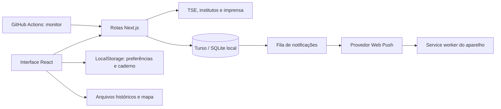

# Guia de desenvolvimento

Este guia reúne instalação local, organização, contratos do servidor e verificação. Para publicar, consulte [deployment.md](deployment.md).

## Contribuir com o Observatório do Voto

Correções de interface, acessibilidade, fontes e testes são bem-vindas. Antes de uma mudança grande, abra uma issue com o problema e uma proposta concreta.

### Preparar o ambiente

Use Node.js 24 e npm. Clone o repositório, execute `npm ci` e copie `.env.example` para `.env.local`. O exemplo usa SQLite local; não precisa de credenciais de produção.

```sh
npm run db:init
npm run dev
```

Abra `http://localhost:3000`. Consulte a [arquitetura](#arquitetura) e o [guia de publicação](deployment.md) para o banco remoto e as notificações.

### Enviar uma alteração

1. Crie uma branch com um nome que descreva a mudança.
2. Preserve o comportamento e a identidade visual nas refatorações. Inclua capturas de desktop e celular quando alterar a interface.
3. Use tipos específicos nas fronteiras de dados. Respostas externas devem ser validadas antes de alimentar a interface ou os alertas.
4. Execute `npm run format`, `npm run check` e `npm run build`.
5. Abra um pull request explicando o problema, a solução e como verificou a mudança.

### Dados eleitorais

- Resultados oficiais precisam manter fonte, eleição, turno e data identificáveis. Nunca substitua uma falha de consulta por números inventados ou zeros.
- Não deduza percentuais de pesquisas a partir de manchetes. Registre a metodologia, a base, a data de publicação e o link verificável.
- Cenários pessoais não são previsões ou pesquisas. Não use a ordem de apuração como amostra aleatória para anunciar vitória.
- Atualizações de arquivos em `public/data` precisam passar por `npm run test:data` e manter as atribuições de [NOTICE.md](../NOTICE.md).
- Notas e preferências pessoais permanecem locais. Não introduza coleta de preferências políticas ou telemetria sem uma revisão explícita do produto e da privacidade.

### Relatos e segurança

Não coloque tokens, inscrições push, preferências políticas pessoais ou dados do banco em issues, capturas ou logs. Para vulnerabilidades, siga [SECURITY.md](../SECURITY.md).

O repositório ainda não declara uma licença geral para o código. Consulte [NOTICE.md](../NOTICE.md) antes de redistribuir código ou recursos de terceiros.

## Arquitetura

O Observatório é uma aplicação Next.js App Router com React e TypeScript. A interface mantém preferências no navegador; funções Node.js consultam fontes públicas e persistem cache e inscrições push em libSQL/Turso.



### Organização

| Diretório / módulo                                      | Responsabilidade                                                        |
| ------------------------------------------------------- | ----------------------------------------------------------------------- |
| `app/dashboard.tsx`                                     | Navegação, filtros e coordenação das telas                              |
| `app/components/`                                       | Componentes de apresentação extraídos do painel                         |
| `app/insights.tsx`, `app/user-space.tsx`                | Pesquisas, cobertura, acompanhamento, perfil e alertas                  |
| `app/api/`                                              | Fronteiras HTTP: entrada, origem, status e respostas                    |
| `lib/elections.ts`                                      | Normalização de dados oficiais e limite matemático de vitória           |
| `lib/polls.ts`, `lib/media.ts`, `lib/article-image.ts`  | Adaptadores de fontes, cache e prévias permitidas                       |
| `lib/database.ts`                                       | Interface SQL, configuração do libSQL e criação idempotente das tabelas |
| `lib/live.ts`, `lib/alerts.ts`, `lib/content-alerts.ts` | Consulta oficial e identificação de eventos                             |
| `lib/push.ts`                                           | VAPID, fila persistente, tentativas e controle de entregas              |
| `lib/notebook.ts`, `lib/poll-view.ts`                   | Validação do caderno e regras de cenários e bases das pesquisas         |
| `public/`                                               | Service worker, ícones, fontes, retratos e conjuntos de dados           |
| `tests/`, `scripts/`                                    | Testes de comportamento, validação de dados e smoke test                |

### Municípios, locais e seções

`/api/local-results` consulta o acervo presidencial do primeiro turno de 2026. `uf` é obrigatório. Sem município, retorna os nomes das cidades; `municipality` seleciona o município; `place` seleciona um local; `zone` e `section` selecionam um recorte eleitoral. Códigos são validados antes de qualquer acesso ao disco. O app não consulta títulos, identidades de eleitores ou votos individuais.

O CSV nacional de votos por seção contém nome/endereço do local, zona e seção. Ele é importado explicitamente, nunca durante um build nem em uma requisição de usuário:

```sh
python scripts/import-local-results.py --zip caminho/votacao_secao_2026_BR.zip
```

Os índices em `data/local-results` são comprimidos por UF, totalizam cerca de 9 MB e são incluídos na função pela configuração `outputFileTracingIncludes`. O servidor mantém até três UFs na memória; clientes recebem somente a lista de cidades ou o município solicitado. O ZIP/CSV original permanece fora do Git. `manifest.json` registra origem, geração e importação. A fonte é o [Portal de Dados Abertos do TSE](https://dadosabertos.tse.jus.br/dataset/resultados-2026), com atribuição na interface.

A importação separa candidatos válidos, brancos e nulos, incluindo votos de candidaturas canceladas na categoria de nulos conforme o EA20. A publicação é interrompida se os totais de qualquer UF divergirem. Os testes conferem cada candidato, brancos e nulos contra os 27 arquivos oficiais e rejeitam seções duplicadas. Zona faz parte da chave porque a numeração de seção pode se repetir em zonas diferentes.

Este acervo é um retrato do turno indicado, não uma consulta em tempo real de locais/seções. Deve ser reimportado com o arquivo e regras apropriados para cada novo turno; locais e seções podem mudar. Não misture endereços do primeiro turno com votos de um turno posterior.

`electionNightAvailable` libera o modo ao vivo somente a partir de 25/10/2026 às 17h de Brasília e com uma resposta oficial do segundo turno. Antes disso, a prévia usa o resultado final do primeiro turno, sem inventar uma progressão. A tela ampliada mantém foco, permite fechar com Escape e inclui alternativas textuais dos gráficos/mapas.

### Fontes consultadas automaticamente

Os endpoints e seus estados estão descritos em [Rotas do servidor](#rotas-do-servidor). O carregamento e o cache de prévias são compartilhados em `lib/article-preview.ts`.

O histórico e os retratos eleitorais incluídos em `public/data` são arquivos versionados, não uma coleta contínua. Pesquisas combinam retratos conferidos e descoberta de publicações; nem todo instituto permite extrair números automaticamente. Cada cartão preserva a data da fonte, separada da data da consulta.

A descoberta também consulta o feed oficial do Ipespe e reconhece outros institutos nos feeds jornalísticos. Publicações localizadas manualmente preservam o veículo e a data real em `verifiedPublications`. Elas não se tornam dados numéricos automaticamente: o levantamento Ipespe/ABRAPEL de 10/10 foi incluído em `pollSnapshots` após conferência do relatório original (votos na página 5 e metodologia na página 33). Os totais publicados somam 101% por arredondamento e são preservados; votos válidos não são recalculados a partir dos inteiros arredondados.

Na apuração, o servidor valida o arquivo do TSE e usa cache compartilhado com uma concessão SQL temporária para reduzir consultas concorrentes. As chamadas HTTP são periódicas. Na Vercel, a tela ao vivo também pode abrir WebSocket pelo SDK experimental, com renovação da conexão e fallback HTTP. `next dev` não oferece esse upgrade.

O workflow de monitoramento consulta as APIs públicas para que a coleta não dependa de visitantes. A agenda e os provedores externos podem atrasar; não existe garantia de atualização ou entrega instantânea.

### Experiência PWA

`app/pwa.tsx` detecta execução standalone (incluindo `navigator.standalone` no iOS), retém `beforeinstallprompt` somente até o uso e distingue instalação aceita de abertura pelo ícone. Sem prompt nativo, mostra instruções por plataforma. Usa `getInstalledRelatedApps` quando disponível e registra `appinstalled`/execução standalone em `observatorio.app-installed` como indicação local. O registro pode ficar desatualizado depois de uma remoção; uma nova oferta nativa de instalação o limpa. Instalação solicitada, presença do app e execução standalone são estados distintos. Em uma aba comum, a ajuda explica como abrir pelo ícone, sem prometer abrir uma janela nativa por código.

O modo instalado inclui navegação fixa, atalhos no manifest e Wake Lock opcional na noite da apuração; o lock é liberado ao fechar a tela e retomado quando ela volta a ficar visível, sujeito ao sistema. O service worker guarda apenas os arquivos da área offline, limpa versões antigas de seu próprio cache e não armazena APIs de apuração/pesquisas. Ao tocar em um alerta, tenta reutilizar uma janela da mesma origem antes de abrir outra.

`observatorio.offline-result` contém uma cópia explícita de resultado nacional finalizado, validada por `lib/pwa.ts`. A área offline (`public/offline.*`) lê essa cópia e o caderno local com `textContent`, sem rede, edição ou interpretação de HTML de anotações. Dados e instalação podem ser removidos pelo aparelho; armazenamento separado entre navegador e app não é sincronizado. Os recursos offline precisam que o service worker tenha instalado seu pequeno conjunto de arquivos enquanto havia conexão.

### Persistência e privacidade

As tabelas `cache`, `subscriptions`, `subscription_keys`, `push_events` e `push_deliveries` armazenam dados públicos, configuração VAPID e o necessário para entrega de alertas. A fila registra evento/aparelho para evitar duplicação e retomar falhas transitórias.

Nome local, candidato preferido, estados seguidos, anotações, tema e aceite dos termos ficam no navegador. Eles não são contas autenticadas nem sincronizados entre aparelhos. O aceite local não é uma prova centralizada vinculada a uma identidade.

`observatorio.municipality` lembra somente UF, código e nome do último município consultado com sucesso. `lib/remembered-city.ts` rejeita dados locais inválidos; a restauração confere o código no índice oficial do estado antes de consultar a cidade. Escola, zona e seção não são persistidas. Falhas de armazenamento não impedem a consulta.

As rotas de escrita verificam origem e validam inscrições. Prévias de artigos usam domínios permitidos, limites de resposta e verificação de redirecionamentos. Segredos não devem usar o prefixo `NEXT_PUBLIC_`.

O layout inclui Vercel Web Analytics para métricas agregadas de acesso. `app/components/site-analytics.tsx` filtra eventos para visualizações e remove parâmetros e fragmentos da URL antes do envio. Não lê preferências, nome, candidato ou anotações do LocalStorage.

### Limites atuais e evolução

O painel e o explorador ainda concentram várias telas; novas alterações devem continuar extraindo componentes e contratos tipados por domínio. Alguns adaptadores legados ainda usam tipos amplos para respostas externas. A normalização eleitoral e os componentes extraídos têm lint mais rigoroso; isso não substitui a revisão das demais fronteiras.

Não há login, permissão de editor, edição de resultados oficiais ou colaboração em notas. O projeto também não mede o engajamento individual de eleitores em redes sociais.

## Rotas do servidor

As rotas são usadas pelo próprio app; não constituem uma API pública com estabilidade contratual garantida. Executam no runtime Node.js. Consultas de dados retornam status e datas para que a interface diferencie espera, atualização e indisponibilidade.

| Rota                       | Método            | Uso                                                                                                         |
| -------------------------- | ----------------- | ----------------------------------------------------------------------------------------------------------- |
| `/api/live?uf=BR`          | GET               | Apuração nacional ou estadual; UF inválida retorna 400                                                      |
| `/api/local-results?uf=SP` | GET               | Cidades, locais e seções do acervo oficial; filtros inválidos retornam 400 e recortes ausentes retornam 404 |
| `/api/polls`               | GET               | Pesquisas verificadas, publicações descobertas e estado de cada fonte                                       |
| `/api/media`               | GET               | Cobertura pública e notícias, com estado da coleta                                                          |
| `/api/events`              | GET               | Último evento eleitoral persistido ou mensagem de ausência                                                  |
| `/api/article-image?url=…` | GET               | Prévia de imagem para URL permitida; entrada inválida retorna 400                                           |
| `/api/push`                | GET               | Chave **pública** VAPID; banco indisponível retorna 503                                                     |
| `/api/push`                | POST              | Registra inscrição e categorias de alertas                                                                  |
| `/api/push`                | DELETE            | Remove inscrição e suas chaves pelo endpoint                                                                |
| `/api/push/test`           | POST              | Envia teste ou consulta confirmação pelo service worker                                                     |
| `/api/push/receipt`        | POST              | Registra recebimento do teste pelo aparelho                                                                 |
| `/api/monitor`             | GET               | Consulta protegida para monitor externo                                                                     |
| `/api/socket`              | GET / upgrade     | Eventos de apuração por WebSocket na Vercel; em `next dev`, 426                                             |
| `/api/rooms`               | GET, POST, DELETE | Compatibilidade com clientes antigos; recurso retirado, retorna 410                                         |

### Apuração

O payload pode indicar `waiting`, `loading`, `live` ou `unavailable`. Quando há resultado, `result` contém eleição, turno, UF, fonte, data, percentual de seções totalizadas, eleitorado, votos e candidatos. `victory.kind` distingue confirmação oficial, limite matemático e resultado parcial. Um cache anterior pode ser marcado como `stale`; ele não deve ser apresentado como consulta recente.

O status HTTP e o estado do payload têm funções diferentes: uma resposta HTTP válida pode informar que a fonte está indisponível. Não considere somente `response.ok` para avaliar a atualidade dos dados.

### Inscrições push

O POST de `/api/push` recebe `{ endpoint, subscription, preferences }`; `subscription` é a serialização de `PushSubscription`. O endpoint precisa coincidir com o da inscrição e pertencer a um provedor permitido. Preferências são normalizadas pelas categorias implementadas em `lib/alerts.ts`.

As operações de escrita verificam a origem; origem externa retorna 403 e inscrição inválida, 400. A chave privada VAPID não é retornada. Não registre endpoints ou material criptográfico em logs ou documentação de exemplos.

O teste recebe `{ endpoint }` e retorna um identificador quando o provedor aceita o envio. Uma consulta com `{ endpoint, check: true, id }` verifica o recibo. Há intervalo mínimo de um minuto por inscrição; tentativas antecipadas retornam 429. Aceitação e recibo não comprovam que a pessoa leu o alerta.

### Monitor

`/api/monitor` exige `Authorization: Bearer CRON_SECRET`. Sem configuração, retorna indisponibilidade; sem autorização válida, rejeita a chamada. O workflow do repositório usa as consultas públicas e não precisa desse segredo. Consulte o [guia de publicação](deployment.md) para separar os ambientes.

## Verificação

### Imagens dos alertas

`lib/news-sources.ts` centraliza os veículos brasileiros selecionados e seus feeds públicos. A identificação do veículo vem do domínio do artigo; o rótulo do agregador não define a fonte. O cache `media:v3` estabelece uma nova linha de base sem enviar os artigos importados como novidade. URLs equivalentes são deduplicadas, cada veículo ocupa até 12 entradas e a lista é ordenada por publicação. O status de cada feed aparece na interface; falhas preservam a última coleta sem prometer atualidade. RSS pode fornecer a imagem; sem ela, usamos metadados de prévia, com domínios permitidos, limite de tamanho e tempo, sem contornar bloqueios ou paywalls.

Atualizações comuns respeitam no mínimo 15 minutos entre resumos por inscrição; as opções de uma hora e um dia ampliam esse intervalo. Eventos selecionados de resultado confirmado, limite matemático e liderança mantêm prioridade. O service worker substitui o aviso comum visível pelo resumo mais recente, preserva alertas decisivos separados e registra apenas o payload efetivamente recebido, sem criar notificações para preencher o histórico.

`public/notification-store.js` mantém até 50 avisos em IndexedDB neste dispositivo e exibe os recebidos nos últimos 30 dias. A interface acessa a lista por `MessageChannel` com o service worker, atualiza ao receber um aviso ou voltar à página e permite limpar somente esse histórico. Não há consulta pública de endpoints, chaves ou entregas de outros usuários. Falhas de armazenamento não impedem a exibição de uma notificação.

Compartilhamentos usam a API nativa quando disponível, cópia do link ou um campo selecionável. Links de resultados são reconstruídos somente com filtros explícitos; município/local compartilhado tem prioridade sobre a preferência local ao abrir o link, sem sobrescrever essa preferência. A API valida o escopo e identifica a seção dentro do local. Preferência por candidato, nome e anotações não integram os links.

### Ensaio da apuração

`tests/election-night-rehearsal.test.ts` executa o fluxo de espera, abertura, perda repetida de conexão e recuperação com relógio e respostas TSE controlados e banco SQLite em memória. Também verifica rejeição de dados de primeiro turno e ausência de repetição do aviso de eleito. O adaptador de envio é substituído e não existem inscrições. Nenhum modo de teste, rota pública ou dado simulado é adicionado à produção. Nas prévias, mantenha banco e inscrições separados conforme `deployment.md`; não use credenciais de produção em ensaios.

Prévias de artigos são resolvidas em `lib/article-preview.ts`, compartilhando o cache da interface e dos alertas. Somente fontes e imagens permitidas são aceitas; sem prévia, o texto continua disponível. Notícias usam a manchete como título. Alertas decisivos podem usar o retrato do candidato relacionado ao evento, independentemente da preferência local do usuário.

O payload push inclui título, texto, destino, categorias e URLs de imagem/ícone. O service worker tenta exibir a imagem e preserva o alerta textual se o navegador rejeitar o recurso. A apresentação final depende do navegador e do sistema operacional. Os testes executam o handler do service worker com payloads controlados; não comprovam a aparência ou a entrega em um aparelho real.

### Comandos

| Comando                | Verifica                                                                                |
| ---------------------- | --------------------------------------------------------------------------------------- |
| `npm run format:check` | Formatação de código e documentação; arquivos de dados e recursos gerados são excluídos |
| `npm run lint`         | Erros estáticos, variáveis sem uso, regras e dependências de hooks                      |
| `npm run typecheck`    | Tipagem TypeScript sem gerar arquivos                                                   |
| `npm run test:data`    | Totais eleitorais, histórico, limites de vitória e leitura das pesquisas                |
| `npm run test:unit`    | Regras de domínio, validação, persistência, concorrência e notificações                 |
| `npm run check`        | Formatação, lint, tipos e todos os testes automatizados                                 |
| `npm run build`        | Compilação de produção do Next.js                                                       |
| `npm run test:smoke`   | HTTP, recursos PWA, metadados e entradas das APIs de uma instância em execução          |

O CI executa `npm ci`, `npm run check` e `npm run build` em pushes e pull requests. Os testes não precisam de tokens de produção. Casos que consultam adaptadores usam respostas controladas; o smoke test consulta fontes reais e depende da disponibilidade externa.

### Smoke test local

Configure `.env.local` com o banco SQLite de desenvolvimento. Após o build, inicie a aplicação com `npm start`. Em outro terminal:

```sh
npm run test:smoke
```

Para outro endereço, use `npm run test:smoke -- http://localhost:3003` ou defina `TEST_URL` antes de executar. O teste consulta APIs e gera a chave VAPID no banco configurado, mas não registra um aparelho nem envia notificações.

### Revisão manual antes de publicar

- Navegação e filtros de eleição, turno, estado e região; retorno pelo histórico do navegador.
- Layout no celular e desktop, expansão independente de cartões, teclado, foco e movimento reduzido.
- Boas-vindas, termos, tema automático e persistência das preferências.
- Criar, editar, excluir e desfazer anotações; conferir indicação de salvamento após recarregar.
- Espera, indisponibilidade, dados parciais e dados finais na apuração, sem exibir uma eleição incorreta.
- Alertas: permissão, inscrição, teste no aparelho e comportamento com a página fechada.
- Na Vercel, conferir WebSocket e fallback HTTP, monitor agendado e banco separado nas prévias.

Testes de servidor não comprovam entrega push pelo sistema operacional. Desktop, Android e iPhone precisam de verificação nos aparelhos e navegadores suportados; no iPhone, verificar a instalação na tela inicial.
